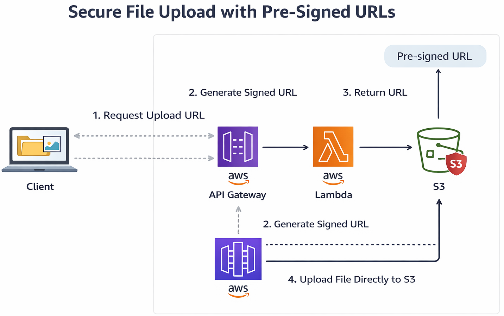

# Secure Serverless File Upload using AWS (Pre-Signed URLs)

This project demonstrates a **secure and scalable serverless architecture** for uploading files directly to **Amazon S3** using **pre-signed URLs generated by AWS Lambda**.

Instead of sending files through a backend server, the client receives a temporary signed URL and uploads the file directly to S3. This pattern is widely used in modern cloud applications because it reduces backend load and improves scalability.

---

# Architecture Overview

Client → API Gateway → Lambda → Generate Pre-Signed URL → Upload Directly to S3

Flow:

1. Client requests an upload URL
2. API Gateway triggers Lambda
3. Lambda generates a pre-signed URL
4. Client uploads file directly to S3 using PUT request

---

# AWS Services Used

- Amazon API Gateway
- AWS Lambda
- Amazon S3
- AWS IAM

---

# Architecture Diagram



---

# How It Works

### Step 1 — Client Requests Upload URL

Client sends request to API Gateway:

```
GET /upload
```

API Gateway triggers the Lambda function.

---

### Step 2 — Lambda Generates Pre-Signed URL

Lambda generates a temporary signed URL that allows uploading a file directly to S3.

---

### Step 3 — Lambda Returns URL

The API response returns:

```
{
 "uploadURL": "presigned-url",
 "fileName": "generated-file-name.jpg"
}
```

---

### Step 4 — Client Uploads File

Client uploads the file using:

```
PUT <presigned-url>
```

Body → binary → image.jpg

The file is uploaded **directly to S3 without passing through Lambda**.

# IAM Policy Used

The Lambda execution role requires permission to upload objects to the S3 bucket.

```
{
 "Version": "2012-10-17",
 "Statement": [
   {
     "Effect": "Allow",
     "Action": "s3:PutObject",
     "Resource": "arn:aws:s3:::secure-file-upload-sudharsan/*"
   }
 ]
}
```

---

# Testing with Postman

### Step 1 — Generate Pre-Signed URL

```
GET https://<api-id>.execute-api.us-east-1.amazonaws.com/prod/upload
```

Response:

```
{
 "uploadURL": "...",
 "fileName": "example.jpg"
}
```

---

### Step 2 — Upload File

Use PUT request:

```
PUT <uploadURL>
```

Body:

```
binary → image.jpg
```

Expected Response:

```
200 OK
```

The file will now appear in the S3 bucket.

---

# Challenges Faced During Development

### SignatureDoesNotMatch Error

Cause:
Incorrect headers were sent from Postman during file upload.

Fix:
Removed unnecessary headers and ensured the request matched the signed parameters.

---

### Request Expired Error

Cause:
Pre-signed URLs expire after a short time.

Fix:
Generated a new URL before uploading the file.

---

### IAM Permission Error

Cause:
Lambda role did not have permission to upload objects to S3.

Error:

```
is not authorized to perform: s3:PutObject
```

Fix:
Added IAM policy allowing the `s3:PutObject` action.

---

# Key Learnings

- Building serverless architectures
- Secure file uploads using pre-signed URLs
- Managing IAM permissions
- API Gateway and Lambda integration
- Debugging AWS authentication errors
- Understanding request signing in AWS

---

# Future Improvements

Possible enhancements for this project:

- Add authentication using Amazon Cognito
- Store file metadata in DynamoDB
- Add file type validation
- Add file size limits
- Serve files through CloudFront CDN

---

# Author

Sudharsan B  
Cloud & DevOps Enthusiast  
B.E Computer Science Engineering  
Global Institute of Engineering and Technology, Vellore
