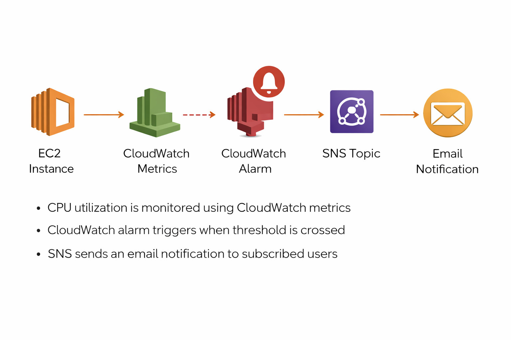

# AWS Cloud Monitoring & Alerting System (CloudWatch + SNS)

This project demonstrates how to build a **real-time monitoring and alerting system on AWS** using **Amazon EC2, CloudWatch, and SNS**.

The system continuously monitors CPU utilization of an EC2 instance and automatically sends **email alerts** when the threshold is exceeded. This is a common production pattern used for infrastructure monitoring.

---

# Architecture Overview

EC2 Instance → CloudWatch Metrics → CloudWatch Alarm → SNS → Email Notification

Flow:

1. EC2 instance generates CPU metrics
2. CloudWatch collects and monitors metrics
3. Alarm triggers when threshold is breached
4. SNS sends notification to email

---

# AWS Services Used

- Amazon EC2
- Amazon CloudWatch
- Amazon SNS (Simple Notification Service)
- AWS Systems Manager (SSM)
- AWS IAM

---

# Architecture Diagram



---

# How It Works

### Step 1 — Launch EC2 Instance

An EC2 instance is launched to act as the monitored resource.

CloudWatch automatically collects metrics such as:
- CPU utilization
- Network usage
- Disk activity

---

### Step 2 — Monitor Metrics in CloudWatch

Navigate to CloudWatch → Metrics → EC2 → Per-Instance Metrics

Select:

```
CPUUtilization
```

This displays real-time CPU usage of the instance.

---

### Step 3 — Create CloudWatch Alarm

Configure an alarm with:

```
Metric: CPUUtilization
Threshold: > 70% (adjusted to 20% for testing)
Evaluation: 1 out of 1 datapoints
Period: 5 minutes
```

The alarm triggers when CPU exceeds the defined threshold.

---

### Step 4 — Configure SNS Notification

Create an SNS topic and subscribe an email address.

```
Topic Name: cpu-alert-topic
```

Confirm the subscription via email.

---

### Step 5 — Connect to EC2 (SSM Session Manager)

Instead of SSH, connect using:

```
Session Manager
```

IAM Role required:

```
AmazonSSMManagedInstanceCore
```

---

### Step 6 — Simulate High CPU Load

Run the following commands inside EC2:

```bash
sudo yum install stress -y
stress --cpu 2 --timeout 300
```

This increases CPU usage to trigger the alarm.

---

### Step 7 — Alarm Triggered

CloudWatch detects high CPU:

```
OK → ALARM
```

SNS sends an email notification.

---

### Step 8 — Stop Load

```bash
pkill stress
```

Alarm returns to:

```
ALARM → OK
```

---

# Testing

### CPU Load Simulation

```
stress --cpu 2 --timeout 300
```

### Expected Behavior

- CPU spikes above threshold
- Alarm state changes to ALARM
- Email notification received

---

# Challenges Faced During Development

### EC2 Connection Issues

Cause:
SSH connection failed due to security group / key issues

Fix:
Used **SSM Session Manager** instead of SSH

---

### SSM Not Connecting

Cause:
IAM role not attached to EC2

Fix:
Attached:

```
AmazonSSMManagedInstanceCore
```

---

### Alarm Not Triggering

Cause:
Threshold too high (70%)

Fix:
Reduced threshold to 20% for testing

---

### Understanding CloudWatch Delay

Cause:
Metrics take time to update

Fix:
Waited 2–5 minutes for evaluation

---

# Key Learnings

- Real-time monitoring with CloudWatch
- Creating and configuring alarms
- SNS notification system
- IAM role importance in AWS services
- Using Session Manager instead of SSH
- Debugging real-world cloud issues

---

# Future Improvements

- Integrate Auto Scaling based on CPU
- Add Slack/Telegram alerts
- Create CloudWatch dashboards
- Use custom metrics
- Multi-instance monitoring setup

---

# Author

Sudharsan B  
Cloud & DevOps Enthusiast  
B.E Computer Science Engineering  
Global Institute of Engineering and Technology, Vellore
