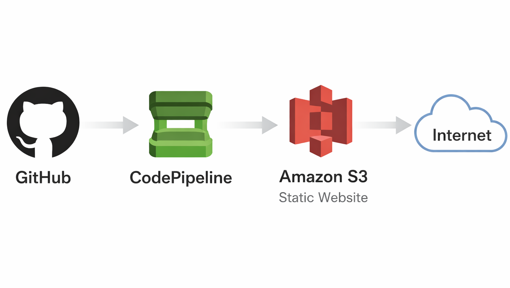

This project demonstrates how to build a simpl
atic website without any manual steps.

3. Pipeline triggers automatically  
4. Files are deployed to S3 bucket  
5. Website updates instantly  

- AWS CodePipeline  
- Amazon S3  
- GitHub  

---

# Architecture Diagram

---

- Connected GitHub repository  
- Selected main branch  

---

## Step 3 — Build Stage

- Skipped build stage (not required for static website)  

---

## Step 4 — Deployment

- Configured deploy stage with S3  
- Enabled file extraction before deploy  

---

## Step 5 — Automatic Trigger

- Any commit to GitHub triggers pipeline  
- Pipeline deploys updated files automatically  

---

# Pipeline Flow

GitHub → Source Stage → Deploy Stage → S3 Website

---

# Steps to Run

1. Create S3 bucket  
2. Enable static website hosting  
3. Create CodePipeline  
4. Connect GitHub repository  
5. Configure S3 deployment  
6. Push code changes  

---

# Access

http://<your-s3-website-url>

---

# Challenges Faced

- Pipeline not triggering → Fixed GitHub connection  
- Website not updating → Verified S3 deploy settings  
- File not extracted → Enabled extract option  

---

# Key Learnings

- CI/CD pipeline basics  
- Automating deployments  
- GitHub integration with AWS  
- S3 static website hosting  
- Event-driven workflow  

---

# Author

Sudharsan B  
Cloud & DevOps Enthusiast
